# Grafos de arquitectura y plan de transición — KimünKo

**Fecha:** 2026-09-17
**Commit auditado:** `3708bbe676705504ece8bd00520278a60909cb83` (rama `main`)
**Base de datos:** proyecto Supabase `eaodsaiwzhbgehhfnegj`, PostgreSQL 17.6
**Relación con `LEVANTAMIENTO_ARQUITECTURA.md`:** este documento lo continúa, no lo
reemplaza. El levantamiento midió acoplamiento de código y evaluó los nueve
criterios. Aquí se agregan la vista de datos y la de despliegue, se corrigen tres
afirmaciones suyas, y se define el plan de transición.

**Alcance:** solo lectura sobre el código y sobre el esquema vivo. Este archivo es
lo único que se escribió. Ninguna migración fue ejecutada.

---

## 1. Cómo leer este documento

Un solo grafo no alcanza. Las tres preguntas que decide una separación de
servicios tienen respuestas distintas en este proyecto, y dibujarlas juntas es
precisamente lo que hace que una extracción parezca barata cuando no lo es:

| Vista | Pregunta que responde | Arista = |
| :--- | :--- | :--- |
| **Acoplamiento de código** | ¿Qué módulo deja de compilar si borro aquel? | un `import` real |
| **Propiedad de datos** | ¿Qué se rompe si muevo esa tabla a otra base? | una FK, un join embebido, un trigger o una policy |
| **Despliegue** | ¿Qué se cae junto y qué escala junto? | pertenencia a la misma unidad desplegable |

El caso que ilustra por qué son tres: **certificación**. En la vista de código es
el seam más limpio del proyecto (dos puntos de llamada). En la vista de datos
arrastra tres FK `RESTRICT`, dos joins embebidos de PostgREST, un trigger que lee
`profiles` y una consulta a `profiles` por rol y sede. El levantamiento la
recomendó como candidata principal mirando solo la primera vista. La §3 muestra
por qué eso cambia.

**Regla de evidencia.** Toda arista de todo grafo se sostiene en un import con
archivo y línea, en una constraint con nombre, o en una consulta citada. Nada se
dibuja por intuición. Cuando una arista es *ausencia* de acoplamiento, también se
dice cómo se verificó.

### Correcciones al levantamiento anterior

1. La tabla es **`support_ticket_messages`**, no `support_messages`.
2. El inventario por capacidad omitía **`event_documents`** y **`event_photos`**.
   Son 24 tablas en `public`.
3. **Reportes no está "sin dependencias entrantes ni salientes".**
   `(dashboard)/layout.tsx:6` y `admin/layout.tsx:6` importan `getWorkerAlerts` /
   `getAdminAlerts`. Está en los dos layouts, es decir, en **cada navegación** de
   ambos shells.

---

## 2. Estado actual

### 2.1 Vista de acoplamiento de código

Aristas = importaciones reales entre capacidades. La etiqueta es el número de
puntos de llamada verificados, no de imports.

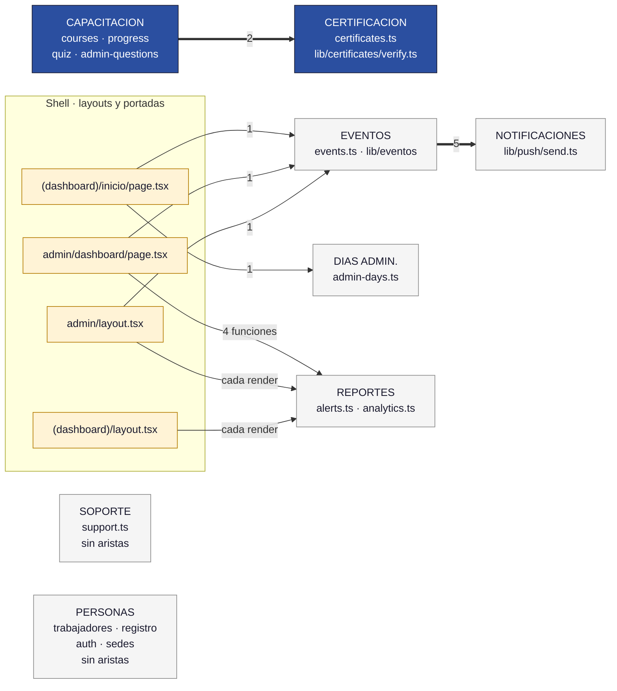

**Evidencia de las aristas entre capacidades:**

| Arista | Evidencia del import | Puntos de llamada |
| :--- | :--- | :--- |
| capacitación → certificación | `progress.ts:5` (estático), `quiz.ts:387` (`await import`) | 2 — `progress.ts:172`, `quiz.ts:388` |
| capacitación interna | `quiz.ts:6` → `./progress` | 1 — `quiz.ts:369` |
| eventos → notificaciones | `events.ts:7` | 5 — `:331`, `:513`, `:581`, `:742`, `:798` |
| shell → reportes | `(dashboard)/layout.tsx:6` (`getWorkerAlerts`), `admin/layout.tsx:6` (`getAdminAlerts`), `admin/dashboard/page.tsx:5` + `:12-14` (3 funciones de `analytics`) | en cada render de ambos layouts |
| shell → eventos | `inicio/page.tsx:11`, `admin/layout.tsx:7`, `admin/dashboard/page.tsx:6` | 3 |
| shell → días admin. | `inicio/page.tsx:7`, `perfil/page.tsx:8`, `admin/trabajadores/[id]/page.tsx:7` | 3 |

**Ausencias verificadas.** `grep '@/lib/actions/' src/lib/actions/` devuelve cero:
no hay un solo import por alias entre los 19 módulos de acción. Las tres aristas
reales usan rutas relativas (`./progress`, `./certificates`). Soporte y personas
no importan ni son importados por ningún otro módulo de acción.

### 2.2 Vista de propiedad de datos

Las 24 tablas de `public`, agrupadas por la capacidad que las posee. `profiles`
va aparte porque su situación no se parece a la de ninguna otra tabla: la
referencian 16 tablas distintas y, sobre todo, la leen las cuatro funciones que
sostienen toda la RLS del sistema.

Las aristas gruesas cruzan frontera de capacidad. Son las que bloquean una
separación de datos.

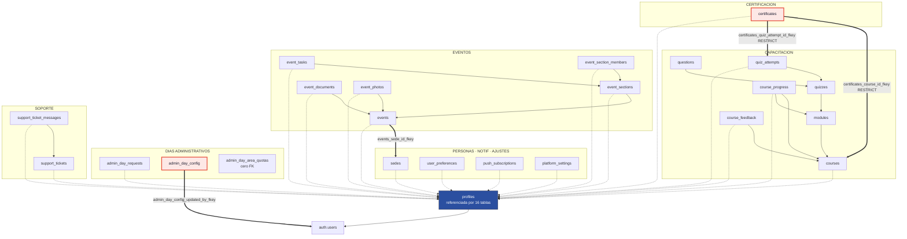

> Las flechas punteadas hacia `profiles` son las 16 tablas que la referencian. Se
> dibujan aparte porque no distinguen capacidad: **todas** la tocan.

**Las cuatro FK que cruzan capacidad** (nombre real de la constraint):

| Constraint | Origen → destino | `ON DELETE` | Consecuencia |
| :--- | :--- | :--- | :--- |
| `certificates_course_id_fkey` | certificación → capacitación | `RESTRICT` | no se puede borrar un curso con certificados emitidos |
| `certificates_quiz_attempt_id_fkey` | certificación → capacitación | `RESTRICT` | el certificado ancla el intento que lo justifica |
| `events_sede_id_fkey` | eventos → personas | `NO ACTION` | el scoping por sede de eventos vive en la FK |
| `admin_day_config_updated_by_fkey` | días admin. → **`auth.users`** | `NO ACTION` | única FK del proyecto que apunta a `auth`, no a `profiles` |

**Joins embebidos de PostgREST que cruzan capacidad.** No son FK, son consultas:
si las tablas quedan en bases distintas dejan de existir, sin que ningún
`ALTER TABLE` avise.

| Sitio | Consulta | Cruce |
| :--- | :--- | :--- |
| `certificates.ts:117` | `select('… courses(title, created_by)')` | certificación → capacitación |
| `verify.ts:60` | `select('… profiles(full_name, sede), courses(title)')` | certificación → personas **y** capacitación |
| `trabajadores.ts:190` | `select('… courses(id, title)')` | personas → capacitación |
| `trabajadores.ts:206` | `select('… courses(title)')` | personas → capacitación |

`admin-days.ts` y `support.ts` tienen **cero** joins embebidos. Verificado con un
barrido de `.select('…(…)')` sobre todo `src/`.

### 2.3 Vista de despliegue

Hoy es un nodo. Se dibuja igual, porque el contraste con §4.3 es la evidencia
principal del criterio 2 y del requisito de microservicios desplegados.

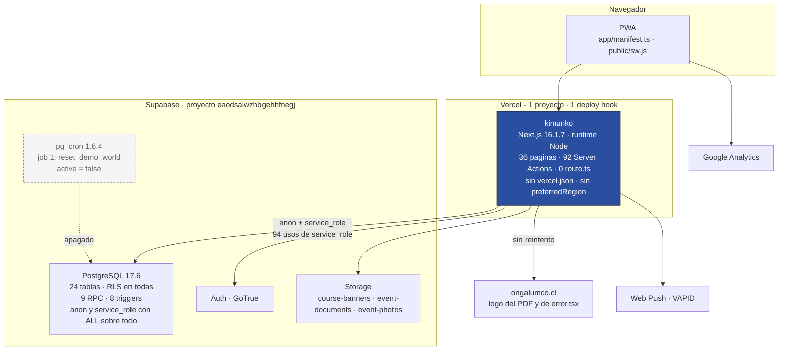

**Hechos verificados de esta vista:**

- **Una sola unidad desplegable.** No existe `vercel.json`. `next.config.ts`
  declara únicamente `optimizePackageImports`. Cero `export const runtime` en
  `src/app/` ⇒ todo corre en Node por defecto.
- **Cero separación de privilegios en la base.** `anon`, `authenticated` y
  `service_role` tienen `SELECT, INSERT, UPDATE, DELETE, TRUNCATE, REFERENCES,
  TRIGGER` sobre **todas** las tablas de `public`. Lo único que separa a un
  visitante anónimo de `profiles` es la RLS. No hay un solo `GRANT` que acote
  nada.
- **La base no puede llamar hacia afuera.** `pg_net` (0.20.0) y `http` (1.6)
  están *disponibles pero no instaladas*; `pgmq` (1.5.1), tampoco. Esto decide el
  diseño de la §4 — ver la resolución explícita en §4.5.
- **Un bucket fantasma.** `trabajadores.ts:340` escribe en el bucket `firmas`,
  que no existe: los reales son `course-banners`, `event-documents` y
  `event-photos`. Tampoco hay bucket de certificados, lo que confirma que
  `pdf_url` nunca se llena.
- **Volúmenes hoy:** 60 `profiles`, 30 `modules`, 13 `courses`, 8
  `quiz_attempts`, 5 `course_progress`, 3 `certificates`, 3
  `push_subscriptions`, 2 `events`, 1 `admin_day_requests`, **0
  `support_tickets`**, 0 `support_ticket_messages`.

---

## 3. Bloqueadores de separación

### 3.1 Los tres bloqueadores transversales

Estos no pertenecen a un candidato: afectan a todos, y son los que el
levantamiento no registró.

**B-T1 · Toda la RLS del sistema lee `profiles`.**
Las cuatro funciones que sostienen las políticas son, literalmente:

```sql
is_admin()       -- select exists (select 1 from profiles where id = auth.uid() and role = 'admin')
is_staff()       -- select exists (select 1 from profiles where id = auth.uid() and role in ('admin','profesor'))
user_sede()      -- select sede    from profiles where id = auth.uid()
viewer_is_demo() -- select is_demo from profiles where id = auth.uid()
```

Consecuencia: **ninguna tabla puede mudarse a otra base sin perder su modelo de
seguridad**, porque sus políticas dejan de poder resolverse. Esto alcanza incluso
a días administrativos, el módulo "más aislado": `adr_select_own_or_staff` y
`adr_update_own_or_staff` usan `is_staff()`, y `adc_write_staff` /
`adq_write_staff` también. Es el bloqueador decisivo, y es más fuerte que las 16
FK: una FK se puede bajar a una comprobación de aplicación; una policy que no
puede leer `profiles` simplemente no se evalúa.

**B-T2 · `reset_demo_world()` es una RPC transaccional que cruza cinco capacidades.**
En un solo cuerpo borra e inserta en `quiz_attempts`, `certificates`, `courses`,
`modules`, `quizzes`, `questions`, `course_progress`, `events`, `event_sections`,
`event_tasks`, `event_section_members` y `push_subscriptions`. Mover cualquiera de
esas tablas a otra base rompe la función entera. Además sigue siendo ejecutable
por `anon`, y su job de `pg_cron` sigue `active = false`.

**B-T3 · `requireAdmin` lee `profiles` en cada request.**
`src/lib/auth/requireAdmin.ts:19-23` consulta `profiles.role` por request (está
memoizado con `cache()` de React, es decir, por request, no entre requests). Todo
servicio que se extraiga necesita autorizar, y toda autorización es una lectura de
`profiles`. `profiles` no es una tabla de referencia fría: está en el camino
caliente de cada petición de cada servicio.

### 3.2 Por candidato

#### Días administrativos

| Tipo | Bloqueador |
| :--- | :--- |
| FK cruzada | `admin_day_requests_user_id_fkey` (CASCADE) y `_reviewed_by_fkey` (SET NULL) → `profiles`. `admin_day_config_updated_by_fkey` → `auth.users`. `admin_day_area_quotas` no tiene ninguna FK. |
| RLS | Las 5 policies usan `is_staff()` o `auth.uid()` ⇒ **B-T1**. |
| Triggers / RPC | Ninguno. Es la única capacidad sin triggers propios. |
| Imports cruzados | **Ninguno.** No importa ni es importado por ningún módulo de acción. Cero joins embebidos. |
| **Estado compartido** | **`getOverdueCourseTitles` (`admin-days.ts:106-130`) lee `courses`, `course_progress` y `profiles`, y `createAdminDayRequest` (`:255-257`) bloquea la solicitud si hay cursos vencidos.** Es una dependencia **síncrona de negocio** hacia capacitación, no una lectura incidental como decía el levantamiento. |
| Estado compartido | `is_demo` **no existe** en `admin_day_requests`. Hoy un usuario del mundo demo crea solicitudes reales. |

#### Soporte

| Tipo | Bloqueador |
| :--- | :--- |
| FK cruzada | Solo hacia `profiles`, las tres con `SET NULL`. |
| RLS | `stm_select_visible` y `stm_insert_participant` referencian `support_tickets` — intra-capacidad. Usan `is_staff()` ⇒ **B-T1**. |
| Triggers / RPC | `touch_support_ticket`, solo `updated_at`. Autónomo. |
| Imports cruzados | Ninguno. Cero joins embebidos. |
| Estado compartido | `is_demo` en `support_tickets`. Ya denormaliza identidad: `support.ts:86` guarda `requester_name` y `requester_email` dentro del ticket. |

Es, a nivel de datos, el candidato más limpio del proyecto. La §5 explica por qué
aun así no se separa.

#### Certificación

| Tipo | Bloqueador |
| :--- | :--- |
| FK cruzada | `certificates_course_id_fkey` y `certificates_quiz_attempt_id_fkey`, **ambas `RESTRICT`**, más `certificates_user_id_fkey` `RESTRICT` → `profiles`. |
| RLS | `certificates: admin ve todos` hace subquery directa a `profiles`. |
| Triggers | `trg_is_demo_certificates` ejecuta `set_is_demo_from_user()`, que **lee `profiles` desde dentro de la base**. `tr_set_certificate_verification_code` sí es autónomo. |
| Imports cruzados | 2 puntos de llamada entrantes (`progress.ts:172`, `quiz.ts:388`). Esta es la parte barata. |
| **Joins embebidos** | `certificates.ts:117` → `courses`. `verify.ts:60` → `profiles` **y** `courses`. |
| **Consulta por rol y sede** | `certificates.ts:142-148` busca la directora firmante en `profiles` filtrando por `role='admin'` **y** `sede = worker.sede`. No es una lectura por id: es una consulta sobre el padrón completo. |

La última fila es la que descarta la réplica de identidad: una copia local de
`{id, nombre}` por trabajador no puede responder "¿quién es la admin de esta
sede?".

#### Notificaciones

Sin FK cruzadas salvo `push_subscriptions_user_id_fkey` → `profiles`. Un solo
consumidor de negocio (`events.ts`, 5 llamadas) y un botón de prueba
(`push.ts:90`). No hay nada que desacoplar: ya es una hoja.

#### Eventos

Seis tablas propias, `events_sede_id_fkey` → `sedes`, RLS de las cinco tablas
hijas resuelta por `EXISTS` contra `events` + `user_sede()`, dos buckets privados
de Storage, y tres puntos de filtración al shell (`inicio/page.tsx:11`,
`admin/layout.tsx:7`, `admin/dashboard/page.tsx:6`). Además `demoScope.ts:89` y
`:105` hacen joins embebidos hacia `events` para resolver el scope demo. Es el más
acoplado, como decía el levantamiento.

### 3.3 `profiles`: las tres opciones y su costo

| | (a) Permanece en el núcleo, referencia de solo lectura | (b) Copia mínima por servicio, sincronizada por evento | (c) Identidad como servicio propio |
| :--- | :--- | :--- | :--- |
| **Qué se gana** | La RLS sigue funcionando sin tocarse. `is_staff()` y `user_sede()` siguen siendo verdad en todos los servicios. Costo de migración: cero. | Cada servicio responde sin llamar al núcleo. Autonomía real en lectura. Ya existe el precedente en `support.ts:86`. | Frontera de identidad explícita y auditable. Es la respuesta "de libro". |
| **Qué integridad se pierde** | Ninguna. Pero tampoco se gana autonomía de datos: la separación es de cómputo, no de almacenamiento. | Las 16 FK hacia `profiles` desaparecen en los servicios que copien. Se pierde la garantía de que `user_id` existe. Ventana de inconsistencia entre el cambio y su propagación. | Todo lo de (b), más duplicar o federar Supabase Auth, que es quien emite el JWT que `auth.uid()` lee. |
| **Qué habría que construir** | Un contrato de lectura por cada dato de identidad que un servicio necesite y hoy obtenga por join. | Un canal de eventos de identidad (sin `pg_net`, sería polling), una tabla espejo por servicio y reconciliación. Y **no cubre** las consultas por atributo: `certificates.ts:142-148` pregunta por rol y sede, no por id. | Un emisor de tokens propio, migración de 60 usuarios, y reescritura de las 4 funciones de RLS y de todas las políticas que las usan. |
| **Veredicto** | **Recomendada.** | Descartada para este trimestre. | Fuera de alcance. |

**Fundamento.** El requisito del ramo es que los microservicios queden
**desplegados y funcionales**, y eso se cumple separando unidades de despliegue,
no necesariamente bases de datos. Separar `profiles` obliga a reconstruir el
modelo de seguridad completo (B-T1) —hoy lo mejor que tiene el proyecto en el
criterio 7— para ganar una autonomía de datos que ninguna carga real justifica:
60 perfiles, 1 solicitud de días administrativos, 0 tickets de soporte. Sería
cambiar una fortaleza por una figura.

Lo que sí se separa, y se hace explícito, es la **propiedad**: cada servicio pasa
a tener su propio rol de Postgres con `GRANT` acotados a sus tablas. Eso convierte
la propiedad de datos de convención en regla verificable, que es el punto
arquitectónico real. Ver §4.4.

---

## 4. Estado objetivo del trimestre

**Hipótesis original, refutada en un punto.** Se proponía núcleo +
`svc-dias-administrativos` + `svc-certificacion`. Lo primero se confirma; lo
segundo cambia de forma: **no se extrae certificación, se extrae verificación**.

La emisión del certificado vive donde viven sus dos FK `RESTRICT`, su trigger que
lee `profiles` y su consulta de firmante por rol y sede: en el núcleo. Lo que sí
tiene un perfil genuinamente distinto es la **verificación pública del folio**:
es la única superficie sin sesión del sistema, la usa un tercero (un fiscalizador
de SENAMA) y no un trabajador, y es la única parte que **debe seguir en pie
cuando el LMS está caído**. Un certificado que no se puede verificar porque la
plataforma de capacitación tuvo un despliegue fallido es un certificado que no
acredita.

Resultado: **tres unidades de despliegue, una por persona del equipo.**

### 4.1 Objetivo — acoplamiento de código

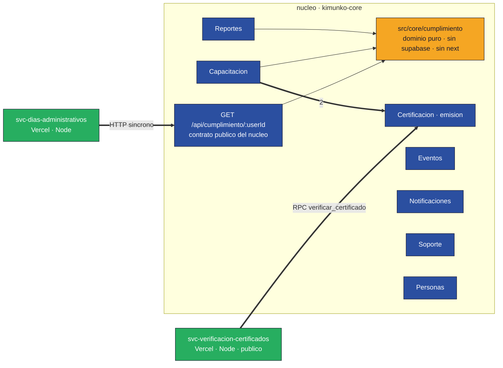

La novedad no es que haya dos cajas afuera: es la caja naranja. Hoy la pregunta
"¿qué cursos vencidos tiene este trabajador?" está implementada **cuatro veces**
(§6.1). El contrato obliga a que exista una sola vez, y en un módulo sin
dependencias de infraestructura. La extracción es lo que fuerza el núcleo de
dominio, no al revés.

### 4.2 Objetivo — propiedad de datos

Nada se muda de base. Lo que cambia es **quién tiene permiso sobre qué**, y eso
sí se dibuja.

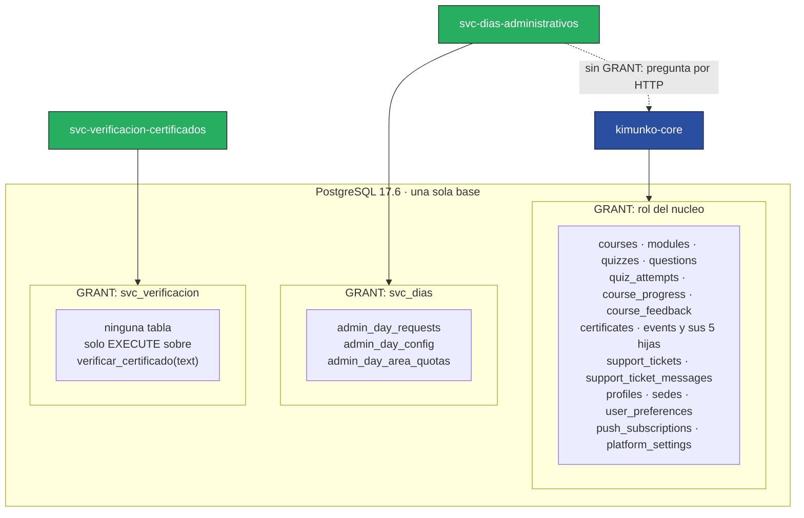

**Tabla de propiedad tras la separación.** "Dueño" = el único servicio con
permiso de escritura.

| Tabla | Dueño | Acceso de los demás |
| :--- | :--- | :--- |
| `courses`, `modules`, `quizzes`, `questions` | núcleo | `svc-dias` solo por el contrato de cumplimiento |
| `quiz_attempts`, `course_progress`, `course_feedback` | núcleo | `svc-dias` solo por el contrato |
| `certificates` | núcleo (emisión) | `svc-verificacion` solo por `verificar_certificado()` |
| `profiles`, `sedes`, `user_preferences` | núcleo | ninguno directo |
| `events` + 5 hijas, `push_subscriptions` | núcleo | ninguno |
| `support_tickets`, `support_ticket_messages` | núcleo | ninguno |
| `platform_settings` | núcleo | ninguno |
| **`admin_day_requests`** | **`svc-dias`** | el núcleo deja de tener `GRANT` de escritura |
| **`admin_day_config`** | **`svc-dias`** | ídem |
| **`admin_day_area_quotas`** | **`svc-dias`** | ídem |

### 4.3 Objetivo — despliegue

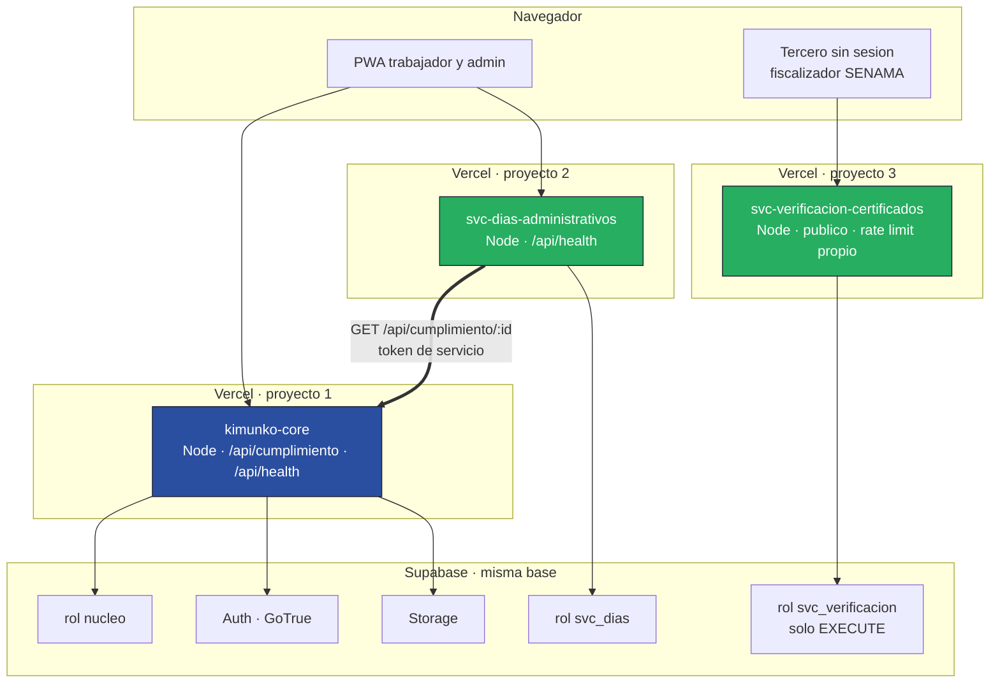

Tres proyectos Vercel, tres deploy hooks, tres ciclos de despliegue
independientes. Un `vercel deploy` del núcleo ya no puede tumbar la verificación
de certificados, que es exactamente la afirmación que el criterio 2 pide poder
demostrar.

### 4.4 Rol de Postgres por servicio

Reemplaza la convención por una regla que la base hace cumplir.

**Punto de partida:** hoy `anon`, `authenticated` y `service_role` tienen **todos
los privilegios sobre todas las tablas**. La única barrera es la RLS, y 94 usos
de `createAdminClient()` la esquivan. La clave `SUPABASE_SERVICE_ROLE_KEY` que
usa el código de días administrativos puede, hoy, escribir en `certificates`.

**Objetivo:** un rol de login por servicio, otorgado a `authenticator` para que
PostgREST pueda asumirlo desde el claim `role` del JWT, que es el mecanismo
estándar de Supabase para roles personalizados.

```sql
-- forma, no migración ejecutable
create role svc_dias nologin;
grant svc_dias to authenticator;
revoke all on admin_day_requests, admin_day_config, admin_day_area_quotas
  from anon, authenticated, service_role;
grant select, insert, update on admin_day_requests to svc_dias;
grant select, update on admin_day_config, admin_day_area_quotas to svc_dias;

create role svc_verificacion nologin;
grant svc_verificacion to authenticator;
grant execute on function public.verificar_certificado(text) to svc_verificacion;
-- svc_verificacion no recibe GRANT sobre ninguna tabla
```

**Tres consecuencias que hay que asumir, no esconder:**

1. Los roles nuevos **no** tienen `rolbypassrls` (`service_role` sí). El servicio
   extraído deja de poder usar `createAdminClient()` y pasa a operar bajo RLS. Es
   trabajo, y es el punto: la autorización deja de ser un `if` de TypeScript.
2. `svc-dias` sigue recibiendo el **JWT del propio trabajador** para las
   operaciones del trabajador, de modo que `auth.uid()` y `is_staff()` siguen
   funcionando igual que hoy. El credencial `svc_dias` se usa solo donde hoy hay
   `createAdminClient()`: `loadConfig` y las acciones de revisión. Dos
   credenciales, dos niveles de confianza, explícitos.
3. El radio de daño de la credencial privilegiada de días administrativos baja de
   **24 tablas a 3**. Eso es medible y es la evidencia del criterio 7.

### 4.5 Resolución de `pg_net` y `pgmq`: no se instalan

Decidido **antes** de dibujar cualquier cola, porque decide si la cola existe.

**La pregunta correcta es qué forma tiene la única dependencia entre servicios.**
Es `svc-dias → núcleo`: *"¿este trabajador tiene cursos vencidos?"*. Se evalúa
mientras el trabajador está llenando un formulario y espera una respuesta. Es
**petición/respuesta síncrona**. Una cola no puede responder una validación de
formulario: aplicarla aquí sería usar el patrón contra su propia definición.

La segunda dependencia, `svc-verificacion → certificados`, es una lectura pura.
Tampoco hay nada que encolar.

La tercera candidata a cola —emisión asíncrona de certificados— **desaparece con
el objetivo elegido**: la emisión se queda en el núcleo, así que la arista
`quiz → certificados` no se corta y no hay evento que publicar.

Añádase que la base **no puede llamar hacia afuera**: sin `pg_net` ni `http`, un
diseño "la base empuja al servicio" exigiría instalar una extensión para servir
una necesidad que no existe; y la alternativa —`pgmq` consumido por polling desde
un cron de Vercel— agrega una pieza móvil, una fuente de latencia y un modo de
fallo nuevo, para 3 certificados emitidos en total.

**Decisión: no se instala `pgmq` ni `pg_net`. El plan no incluye ninguna cola.**
Se documenta qué tendría que volverse verdad para revisarlo: que la emisión de
certificados salga del núcleo, o que el fan-out de push (hoy `Promise.all` sin
límite en `lib/push/send.ts`) empiece a agotar la concurrencia de la función. Ni
una ni otra son ciertas hoy.

Esto deja el criterio 5 más corto de lo que estaría si infláramos el catálogo. Es
deliberado, y §8 lo muestra como hueco en vez de disimularlo.

---

## 5. Fuera de alcance

### Soporte — separable sin costo, y aun así se queda

Es el caso más limpio del proyecto a nivel de datos: cero joins embebidos, FK
solo hacia `profiles` y todas con `SET NULL`, un trigger propio que solo toca
`updated_at`, ningún import cruzado. El levantamiento lo listó como separable
hoy, y tiene razón.

**No se separa, y la razón es que no hay ninguna razón para separarlo.** La tabla
`support_tickets` tiene **0 filas**; `support_ticket_messages`, 0. No hay
escalado distinto que aislar, ni ciclo de despliegue propio que reclamar, ni
superficie de seguridad diferenciada: sus policies ya lo acotan a su dueño y al
staff. El único argumento disponible sería "para tener otro microservicio", que
por la regla de la §6 es exactamente el argumento que descalifica una separación.

Se deja documentado como **deuda intencional**: si soporte adquiere tráfico real o
se integra con un proveedor externo de tickets, es la primera extracción de la
lista, y ya está medida.

### Eventos — el más acoplado, y el más grande

`events.ts` son 1164 líneas, seis tablas, dos buckets privados, una FK a `sedes`,
RLS de cinco tablas resuelta por `EXISTS` contra `events`, y filtración al shell
en tres puntos más dos joins embebidos en `demoScope.ts`. Extraerlo consumiría el
trimestre entero y produciría el servicio con más superficie de UI del proyecto.
Se queda.

### Notificaciones — ya es una hoja

Un consumidor de negocio y un botón de prueba. Extraerlo no reduce ninguna
dependencia: `lib/push/send.ts` ya es un bulkhead que nunca lanza. Separarlo sería
mover una hoja de sitio.

### Certificación (emisión) — se queda, y es un cambio respecto de la hipótesis

Las dos FK `RESTRICT` hacia capacitación, el trigger `set_is_demo_from_user()` que
lee `profiles`, el join embebido de `certificates.ts:117` y la consulta de
firmante por rol y sede hacen que separar la emisión implique rehacer la
composición del PDF antes de haber ganado nada. Lo que sí se extrae es la
verificación pública, que es la parte con perfil distinto. Ver la ficha 7.3.

### IA (PDF → quiz)

Sigue sin existir una línea de código. No es una separación, es construcción. Se
mantiene fuera, como recomendaba el levantamiento (D4).

### Separación de bases de datos

Descartada por B-T1: obliga a reescribir el modelo de seguridad completo. La
separación de este trimestre es de **cómputo y de privilegios**, y se afirma como
tal en la defensa, sin pretender que sea otra cosa.

---

## 6. Hitos de transición

Cada hito termina con el sistema **desplegable y funcionando**. Ningún hito deja
un estado intermedio roto.

### H0 · Cerrar riesgos y poner el gate

Sin esto no se puede cambiar nada con red. `requireAdmin()` en las tres actions de
`sedes.ts`; un workflow que corra `typecheck`, `lint` y `test` antes del deploy
hook. Nada de arquitectura todavía.

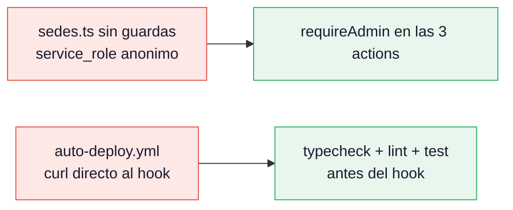

### H1 · Núcleo de dominio del cumplimiento

Una sola implementación de "¿qué cursos con plazo aplican a este trabajador y
cuáles están vencidos?", en `src/core/cumplimiento`, sin Supabase ni `next/*`,
con tests. Los cuatro sitios que hoy la duplican pasan a llamarla. Por fuera el
sistema es idéntico, salvo que se corrige la divergencia de `is_demo` (§7.1).

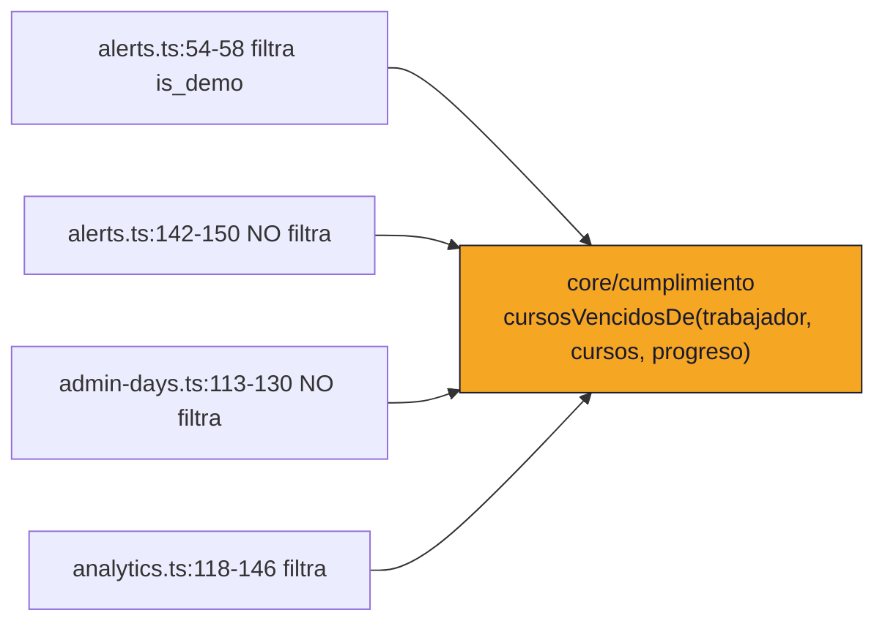

### H2 · El contrato existe, pero todavía adentro

`GET /api/cumplimiento/:userId` en el núcleo, sobre el dominio de H1.
`admin-days.ts` deja de consultar `courses` y `course_progress` y pasa a llamar al
contrato — **en el mismo despliegue**. Nada se movió; la arista de datos ya está
cortada.

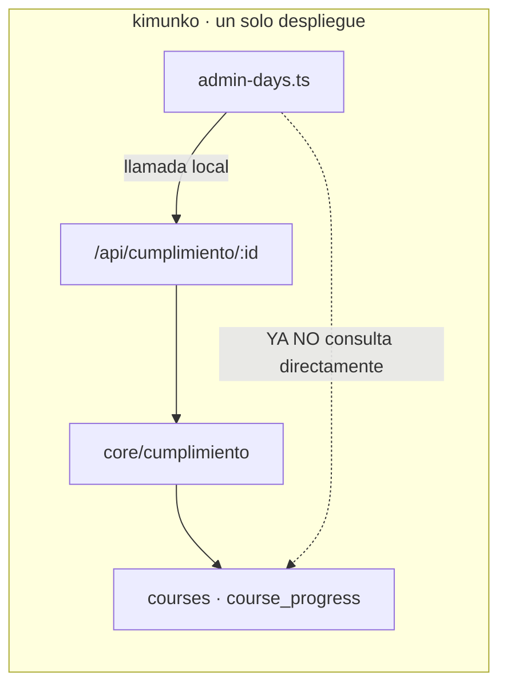

### H3 · Roles de base y frontera de privilegios

Se crean `svc_dias` y `svc_verificacion`, se acotan los `GRANT`, se crea
`verificar_certificado(text)` como `SECURITY DEFINER`. Todavía un solo
despliegue, pero la frontera de permisos ya es real y verificable.

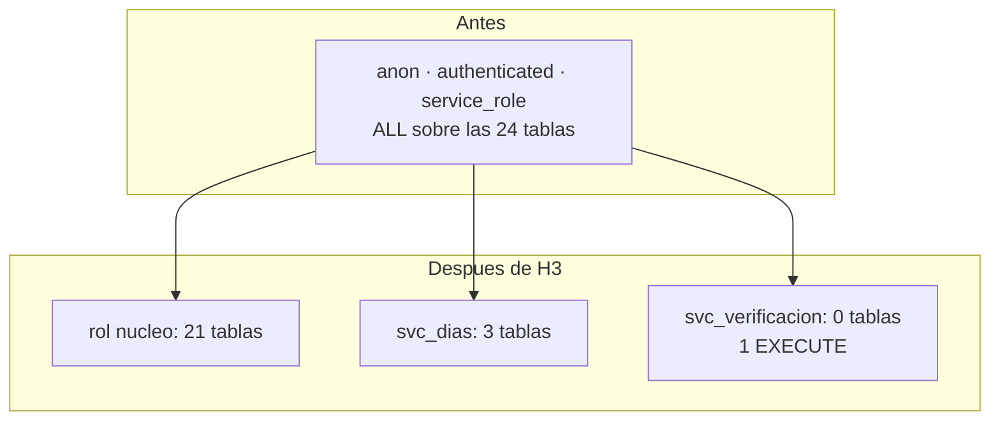

### H4 · Extraer `svc-verificacion-certificados`

El más fácil: sin sesión, sin escritura, sin estado compartido. Se usa para
aprender el procedimiento de despliegue antes de aplicarlo a algo que escribe.

### H5 · Extraer `svc-dias-administrativos`

La llamada local de H2 pasa a ser HTTP remoto. Se agrega la degradación
fail-open con marcador (§7.2).

### H6 · Observabilidad y prueba de degradación

`/api/health` en los tres servicios, logger estructurado, y el experimento de
caos que sostiene el criterio 6: apagar el núcleo y demostrar que la verificación
de certificados sigue respondiendo.

### Grafo de dependencias entre hitos

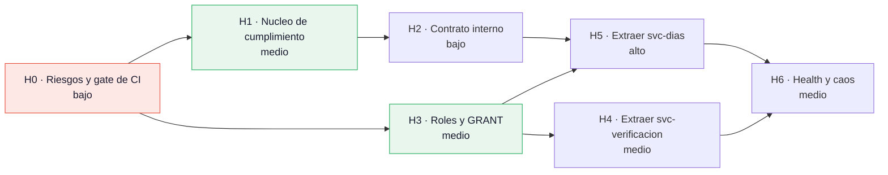

**Reparto con tres personas.** H0 es de todos y va primero: es el único hito que
bloquea todo lo demás. Después, **H1→H2 y H3→H4 corren en paralelo**: no comparten
archivos ni migraciones. La tercera persona prepara H6 (health checks, logger) y
escribe los tests del dominio de H1, que es donde más falta hacen. H5 es el único
que necesita las dos ramas terminadas, y conviene que lo haga quien llevó H2,
porque el contrato ya es suyo.

---

## 7. Guías por rama

### 7.1 Rama: contrato de cumplimiento (corta la arista días admin. → capacitación)

**Qué se separa.** La pregunta "¿qué cursos con plazo aplican a este trabajador y
cuáles están vencidos?" sale de los cuatro sitios que la implementan y pasa a
`src/core/cumplimiento/`, expuesta por `GET /api/cumplimiento/:userId`.
Archivos: `alerts.ts`, `analytics.ts`, `admin-days.ts`. Tablas: `courses`,
`course_progress`, `profiles` (solo `area_trabajo` e `is_demo`).

**Por qué.** No es "para tener microservicios": es que la regla **ya divergió y
hoy produce un resultado incorrecto**. La misma pregunta está escrita cuatro
veces y dos de ellas no filtran el mundo demo:

| Sitio | ¿Filtra `is_demo`? |
| :--- | :--- |
| `alerts.ts:56` — vista admin | sí |
| `alerts.ts:147` — vista trabajador, misma regla, mismo archivo | **no** |
| `admin-days.ts:115` — bloqueo de solicitud | **no** (`is_demo` no aparece ni una vez en el archivo) |
| `analytics.ts:120` — cobertura anual | sí |

Consecuencia hoy, reproducible: un **curso del mundo demo con plazo vencido
impide a un trabajador real solicitar días administrativos**, porque
`admin-days.ts:115` lo cuenta como propio y `:255` bloquea. La rama existe para
que la regla tenga un solo dueño.

**Acoplamiento actual.**
*Código:* ninguno — las cuatro implementaciones son independientes, que es
precisamente el problema. `admin-days.ts:160` llama a su copia local
`getOverdueCourseTitles` (`:106-130`).
*Datos:* `admin-days.ts:115-116` consulta `courses` y `course_progress`, tablas de
capacitación, sin FK que lo declare. Es acoplamiento invisible al esquema.

**Contrato resultante.**

```
GET /api/cumplimiento/:userId
Authorization: Bearer <token de servicio>

200 {
  "userId": "uuid",
  "evaluadoEn": "2026-09-17T12:00:00Z",
  "esDemo": false,
  "cursosVencidos": [
    { "id": "uuid", "titulo": "Manejo de crisis", "deadline": "2026-08-01" }
  ],
  "bloqueaDiasAdministrativos": true
}
```

Síncrono, JSON, HTTP. **Dueño de los datos:** el núcleo es dueño del hecho
("estos cursos están vencidos"); `svc-dias` es dueño de la política ("con cursos
vencidos no se piden días"). La separación importa: si mañana se decide que
vencer un curso solo advierte en vez de bloquear, el cambio es de `svc-dias` y no
toca al núcleo.

**Patrón aplicado.** Ninguno del catálogo de nube. Es la extracción de una regla
de dominio duplicada a un módulo único, con una fachada HTTP. Nombrar aquí CQRS
sería falso: no hay modelo de escritura separado ni consistencia eventual. Es una
consulta síncrona sobre la misma base.

**Pasos.**
1. Escribir `src/core/cumplimiento/` puro, con tests unitarios de los casos que
   hoy divergen (con y sin `is_demo`, con y sin `target_areas`, plazo hoy).
2. Sustituir la copia de `analytics.ts` — es la menos riesgosa, solo lectura de
   panel. Desplegar.
3. Sustituir las dos copias de `alerts.ts`. Desplegar.
4. Sustituir `getOverdueCourseTitles` en `admin-days.ts`. Aquí cambia
   comportamiento (deja de contar cursos demo): verificar con la clienta antes.
   Desplegar.
5. Envolver el dominio en `/api/cumplimiento/:userId` y que `admin-days.ts` lo
   consuma localmente. Desplegar.

**Cómo se verifica.** Un test de integración: crear un curso demo con `deadline`
en el pasado, un trabajador real, y comprobar que
`bloqueaDiasAdministrativos === false`. Hoy ese test falla. Además,
`grep -c "deadline" src/lib/actions/` debe bajar a un solo módulo.

**Degradación.** Ninguna todavía: sigue siendo una llamada en proceso. La
degradación aparece en la rama 7.2, que es cuando cruza la red.

**Rollback.** Revertir el commit. No hay migración de datos: la rama no toca el
esquema.

**Criterios de la rúbrica.** 2 (capa de dominio aislada), 4 (regla pura, testeable,
sin infraestructura), 9 (una consulta en vez de cuatro en el layout).

**Esfuerzo y dependencias.** Medio. Depende de H0.

---

### 7.2 Rama: `svc-dias-administrativos`

**Qué se separa.** `src/lib/actions/admin-days.ts` (486 líneas, 8 actions), las
páginas `(dashboard)/dias-administrativos/`, `admin/dias-administrativos/`, el
componente `components/alumco/dias/`, y las tres tablas `admin_day_requests`,
`admin_day_config`, `admin_day_area_quotas`.

**Por qué.** Tres razones que se sostienen solas:

1. **Ciclo de despliegue propio.** Es el módulo con la regla de negocio más
   volátil del sistema —cupo, período de reset, cuotas por área— y el que menos
   tiene que ver con capacitar. Hoy cambiar el cupo anual obliga a redesplegar el
   reproductor de quizzes.
2. **Superficie de seguridad separada.** Es la única capacidad que maneja datos
   laborales (ausencias, motivos). Hoy la credencial `service_role` que usa puede
   escribir en `certificates` y en `profiles`. Tras la separación, en 3 tablas.
3. **Aislamiento de fallos en sentido útil.** Un error en el cálculo de cupo no
   debe poder tumbar la ruta por la que un trabajador rinde una evaluación
   obligatoria con plazo legal.

Lo que **no** es una razón: escalado. Hay 1 solicitud en la base. Se dice
explícitamente para no fingir una carga que no existe.

**Acoplamiento actual.**
*Código:* entrante, 3 sitios del shell (`inicio/page.tsx:7`, `perfil/page.tsx:8`,
`admin/trabajadores/[id]/page.tsx:7`) más su propia UI. Saliente: **cero** hacia
otros módulos de acción.
*Datos:* `admin_day_requests_user_id_fkey` (CASCADE) y `_reviewed_by_fkey`
(SET NULL) → `profiles`; `admin_day_config_updated_by_fkey` → `auth.users`;
`admin_day_area_quotas` sin FK. Más la lectura no declarada de `courses` y
`course_progress` en `admin-days.ts:115-116`, que la rama 7.1 ya convirtió en
contrato.

**Contrato resultante.**
*Consume:* `GET /api/cumplimiento/:userId` del núcleo, síncrono.
*Expone:* su propia UI y sus Server Actions, más `GET /api/dias/resumen/:userId`
para que el shell del núcleo pueda pintar la tarjeta de `/inicio` y `/perfil` sin
importar el módulo.
*Dueño de datos:* `svc-dias` es dueño exclusivo de sus tres tablas — el núcleo
pierde el `GRANT` de escritura sobre ellas. `profiles` sigue siendo del núcleo y
`svc-dias` la lee bajo RLS con el JWT del propio trabajador.

**Patrón aplicado.** **Bulkhead**, y es el único que corresponde. El problema
concreto: hoy las dos capacidades comparten el mismo pool de funciones
serverless, la misma credencial privilegiada y el mismo despliegue, así que un
fallo o un despliegue malo de una alcanza a la otra. La separación de unidades de
despliegue es la definición del patrón.

No se aplica Circuit Breaker: con un solo consumidor y un solo proveedor, el
timeout más el fail-open de abajo cubren el caso sin agregar estado que mantener.
No se aplica cola, por lo dicho en §4.5.

**Pasos.**
1. (Ya hecho en 7.1) `admin-days.ts` consume el contrato en vez de consultar
   `courses`.
2. Crear los roles y `GRANT` de H3. Verificar que todo sigue funcionando con
   `service_role` todavía activo.
3. Quitar `createAdminClient()` de `admin-days.ts` y pasarlo a la credencial
   `svc_dias`, aún dentro del monolito. Desplegar. **Este es el paso que más
   puede romper**, y se hace sin mover nada de sitio para poder aislar la causa.
4. Añadir `cumplimiento_verificado boolean not null default true` a
   `admin_day_requests` y mostrarlo en el panel de revisión. Desplegar.
5. Crear el proyecto Vercel, mover archivos, apuntar el contrato al host remoto,
   añadir el token de servicio. Desplegar los dos.
6. Redirigir las rutas del núcleo al nuevo host y borrar el código movido.

**Cómo se verifica.** Tres comprobaciones observables:
- `select has_table_privilege('svc_dias','certificates','SELECT')` devuelve
  `false`, y `('svc_dias','admin_day_requests','INSERT')` devuelve `true`.
- Un despliegue del núcleo no interrumpe una solicitud en curso en `svc-dias`
  (se demuestra en vivo durante la defensa).
- Con el núcleo apagado, crear una solicitud sigue funcionando y la fila queda con
  `cumplimiento_verificado = false`.

**Degradación.**
*Si el núcleo está caído y `svc-dias` en pie:* **fail-open con marcador.** La
solicitud se acepta, se graba con `cumplimiento_verificado = false` y el panel de
revisión la muestra señalada. Fundamento: el momento crítico no es cuando el
trabajador llena el formulario, sino cuando el admin aprueba — y esa aprobación ya
es un paso manual. Bloquear a un trabajador porque un servicio ajeno está caído es
peor que diferir la comprobación a un punto donde ya hay una persona mirando.
*Si `svc-dias` está caído y el núcleo en pie:* la plataforma de capacitación
funciona completa. Las tarjetas de días en `/inicio` y `/perfil` se renderizan con
un estado "no disponible" en lugar de romper la página, porque el shell consume el
contrato `GET /api/dias/resumen/:userId` y no el módulo.

**Rollback.** Los pasos 1-4 se revierten por commit. El paso 4 agrega una columna
con `default`, así que revertirlo no pierde datos: se deja la columna huérfana y
se borra después. El paso 5 se revierte devolviendo el `GRANT` al rol del núcleo y
reapuntando las rutas; **las tablas nunca se movieron de base**, que es lo que
hace este rollback barato y es una de las razones de la decisión de §3.3.

**Criterios de la rúbrica.** 2, 3 (segunda unidad serverless real), 6 (degradación
diseñada y demostrable), 7 (radio de daño de 24 tablas a 3), 9 (despliegues
independientes).

**Esfuerzo y dependencias.** Alto. Depende de H2 y H3.

---

### 7.3 Rama: `svc-verificacion-certificados`

**Qué se separa.** `src/lib/certificates/verify.ts`, la página
`src/app/certificados/verificar/[codigo]/page.tsx` y su rate limit. **Ninguna
tabla**: el servicio no recibe `GRANT` sobre nada.

**Por qué.** Es la única parte del sistema con las cuatro propiedades a la vez:
es **pública y sin sesión**, la usa **un tercero** (un fiscalizador, no un
trabajador), tiene un **perfil de amenaza propio** (enumeración de folios), y
**debe sobrevivir a la caída del LMS** — un certificado que no se puede verificar
porque la plataforma está caída no acredita nada ante una fiscalización de SENAMA.

Hay además un beneficio medible y poco obvio. `lib/rateLimit.ts:3-11` documenta
que el límite es *por instancia serverless*, así que el límite real es
`20 × instancias activas`. Un despliegue dedicado, con muchísimo menos tráfico
que el LMS, mantiene muchas menos instancias vivas — el límite efectivo se acerca
al límite pretendido. Separar mejora el rate limit sin cambiar una línea.

**Acoplamiento actual.**
*Código:* `verificar/[codigo]/page.tsx:9` → `verify.ts`; `:4` → `lib/rateLimit`;
`:3` → componentes del design system (`MarcaAlumco`, `Icono`, `Onda`). Cero
imports desde módulos de acción. `verify.ts` importa solo
`@/lib/supabase/server`.
*Datos:* ninguna FK propia. Pero `verify.ts:60` hace
`select('verification_code, issued_at, is_demo, profiles(full_name, sede), courses(title)')`
— un join embebido a **dos** capacidades ajenas, con `service_role`.

**Contrato resultante.** Una función en la base, no una vista:

```sql
-- forma, no migración ejecutable
create function public.verificar_certificado(p_codigo text)
returns table (codigo text, nombre_trabajador text, titulo_curso text,
               emitido_en timestamptz, sede text, es_demo boolean)
language sql stable security definer set search_path = public as $$
  select c.verification_code, p.full_name, co.title, c.issued_at, p.sede,
         coalesce(c.is_demo, false)
  from certificates c
  join profiles p  on p.id  = c.user_id
  join courses  co on co.id = c.course_id
  where c.verification_code = p_codigo;
$$;
```

Síncrono. **Dueño de datos:** el núcleo sigue siendo dueño de las tres tablas;
`svc-verificacion` no es dueño de ningún dato y no tiene `GRANT` sobre ninguna
tabla. Su única capacidad es ejecutar esa función.

**Patrón aplicado.** **Gatekeeper**, y por una razón concreta y no decorativa. Hoy
la protección contra enumerar el padrón de certificados es el `.eq()` de
`verify.ts:61`: una línea de TypeScript. La cabecera del propio archivo
(`verify.ts:44-48`) dice que abrir la tabla "expondría el listado completo". La
función `SECURITY DEFINER` traslada esa intención de la aplicación a la base: un
servicio público **no puede** enumerar, porque su único verbo recibe un folio y
devuelve a lo más una fila. El rate limit de la página (20 por IP cada 10
minutos) es **Throttling**, y se conserva.

Se descarta una vista: `select * from certificado_publico` volvería a permitir la
enumeración, y además Supabase marca las vistas `SECURITY DEFINER` como ERROR en
su advisor — es exactamente lo que ya ocurre con la vista muerta
`reporte_avance`.

**Pasos.**
1. Crear `verificar_certificado(text)`, `GRANT EXECUTE` a `service_role`, y hacer
   que `verify.ts` la llame en vez de armar el join. Sigue todo en un despliegue.
   Desplegar.
2. Crear el rol `svc_verificacion` con solo ese `EXECUTE`. Verificar desde la
   base que no puede leer `certificates` directamente.
3. Crear el proyecto Vercel con la página, el rate limit y los tres componentes
   del design system que usa. Sin variables de Auth: el servicio no las necesita.
4. Apuntar el dominio de verificación al nuevo proyecto y borrar la ruta del
   núcleo.

**Cómo se verifica.**
- `select * from certificates` ejecutado con el rol `svc_verificacion` falla por
  permisos. `select * from verificar_certificado('<folio>')` devuelve una fila.
  Son dos consultas que se corren en vivo en la defensa.
- Con el núcleo apagado, `/certificados/verificar/<folio>` sigue devolviendo 200.
- Las variables de entorno del nuevo proyecto **no** incluyen
  `SUPABASE_SERVICE_ROLE_KEY`.

**Degradación.**
*Si el núcleo está caído:* la verificación sigue en pie y responde. Es la razón
de ser de la rama y el experimento de caos que sostiene el criterio 6.
*Si `svc-verificacion` está caído:* nadie de la ONG se entera —no está en ningún
flujo interno—, y un fiscalizador ve una página de error. El certificado en papel
sigue teniendo el folio impreso y la verificación se puede reintentar. Es el fallo
menos grave del sistema, que es otra razón para que sea la primera extracción.
*Si la base está caída:* ambos caen. No se pretende otra cosa: hay una sola base,
y decirlo es parte de la honestidad del diseño.

**Rollback.** Reapuntar el dominio al núcleo, que conserva la ruta hasta el paso
4. Sin migración de datos: la función se puede dejar creada sin costo, y el
`GRANT` se revoca con una línea.

**Criterios de la rúbrica.** 2, 3 (tercera unidad serverless), 5 (Gatekeeper +
Throttling, ambos con problema que los motiva), 6 (el único servicio que
demuestra supervivencia independiente), 7 (un servicio público con cero `GRANT`
de tabla), 9 (el LMS deja de compartir instancias con una ruta pública).

**Esfuerzo y dependencias.** Medio. Depende de H3.

---

## 8. Mapa rúbrica → rama

| # | Criterio | Ramas que lo cubren | Estado |
| :-: | :--- | :--- | :--- |
| 1 | Personalización de UI e i18n | **ninguna** | **Hueco.** Ver abajo. |
| 2 | Desacoplar la solución | 7.1, 7.2, 7.3 | Cubierto |
| 3 | Serverless con servicios de nube | 7.2, 7.3 | Cubierto — de 1 a 3 unidades desplegadas |
| 4 | Clean Architecture | 7.1 | Cubierto solo en cumplimiento |
| 5 | Patrones de nube | 7.3 (Gatekeeper, Throttling), 7.2 (Bulkhead) | **Parcial y deliberadamente corto** |
| 6 | Chaos Architecture | 7.2 (fail-open con marcador), 7.3 (supervivencia), H6 | Cubierto |
| 7 | Modelo de seguridad explícito | H0, H3, 7.2, 7.3 | Cubierto |
| 8 | Alta concurrencia | **ninguna** | **Hueco.** Ver abajo. |
| 9 | Disponibilidad y respuesta rápida | 7.2, 7.3, H6 | Cubierto |

**Los dos huecos, dichos en voz alta:**

**Criterio 1 — ninguna rama lo toca.** La i18n no tiene relación con separar
servicios; es trabajo transversal sobre 36 páginas y 83 client components.
Depende además de la decisión D1 del levantamiento, que sigue sin respuesta del
profesor: si basta con demostrar que la arquitectura soporta i18n con un solo
locale poblado, el esfuerzo baja de alto a medio. **Hay que preguntarlo antes de
planificar el trimestre**, y no pertenece a este plan.

**Criterio 8 — ninguna rama lo cubre, y la separación no lo mejora.** Las tres
carreras del levantamiento siguen abiertas, verificado contra el esquema vivo:
`quiz_attempts` solo tiene `quiz_attempts_pkey(id)`, sin unicidad sobre
`(user_id, quiz_id, attempt_number)`; `admin_day_requests` solo tiene su PK, sin
constraint de exclusión para el cupo; y el *lost update* de `completed_modules`
sigue en `progress.ts:110-125`. Peor: extraer `svc-dias` **agrava** la tercera
carrera, porque el chequeo de cupo y el insert pasan a estar más lejos uno de
otro. El plan debe incorporar A3 del levantamiento como parte de H0, no como
consecuencia de ninguna rama. Se señala aquí porque es el único criterio que
empeora si se ejecuta el plan sin corregirlo antes.

**Criterio 5 — corto a propósito.** Tres patrones con un problema real detrás,
y ninguna cola. La justificación completa está en §4.5. Inflar el catálogo con
una Saga o un Event Sourcing que nada motiva sería más fácil de escribir y más
difícil de defender.

---

## 9. Riesgos del plan

| Riesgo | Señal temprana | Mitigación |
| :--- | :--- | :--- |
| **H0 no se hace y se empieza por lo entretenido.** Es el patrón más probable: la arquitectura es más atractiva que un workflow de CI. | Aparece un commit que toca `src/core/` antes de que exista el workflow con los tres gates. | H0 es la primera tarea de los tres, y ninguna rama se abre antes. |
| **El paso 3 de 7.2 rompe producción.** Quitar `createAdminClient()` deja al módulo bajo RLS por primera vez; las policies de `admin_day_*` nunca se ejercitaron sin `service_role`. | Errores de permiso en el panel de revisión de días, no en el flujo del trabajador: las acciones de admin son las que hoy usan `service_role`. | Se hace **dentro** del monolito y en su propio despliegue, para que la causa sea inequívoca. Rollback = un commit. |
| **La corrección de `is_demo` cambia comportamiento visible.** Tras 7.1, trabajadores hoy bloqueados por un curso demo vencido pasan a poder pedir días. | Cambio en el número de solicitudes tras el despliegue del paso 4. | Avisar a la clienta antes, no después. Es corrección de un error, pero se ve como cambio de reglas. |
| **El contrato se convierte en un segundo monolito.** `/api/cumplimiento` es cómodo y tienta a colgarle campos que nada tienen que ver. | El endpoint gana un tercer campo que no responde "¿cumple?". | El contrato está congelado en §7.1. Un campo nuevo exige una decisión escrita. |
| **Tres despliegues, cero observabilidad.** Hoy hay 34 `console.*` y ningún health check. Con tres servicios, un fallo se vuelve invisible al triple. | El primer incidente en `svc-dias` se detecta porque alguien reclama. | H6 no es opcional ni el último si sobra tiempo: se empieza en paralelo desde H0, que es para lo que está la tercera persona. |
| **El fail-open se lee como un agujero.** Es la pregunta más probable de la defensa: "¿entonces alguien puede pedir días con cursos vencidos?". | — | La respuesta está diseñada, no improvisada: sí, y queda marcado para el admin, que ya revisa cada solicitud a mano. El fallo cerrado bloquearía a trabajadores por causas ajenas. |
| **Se quiere separar la base "para que sea de verdad".** | Aparece la propuesta de un segundo proyecto Supabase. | B-T1: las cuatro funciones de RLS leen `profiles`. La respuesta está en §3.3 y hay que sostenerla. |
| **Cinco semanas en H1 y nada desplegado.** El núcleo de dominio no tiene techo natural. | Terminó la mitad del trimestre y siguen tres capacidades duplicando la regla. | H1 se acota a **cumplimiento**, no a todo el dominio. Corrección de intentos y aprobación de curso quedan fuera de este plan. |
